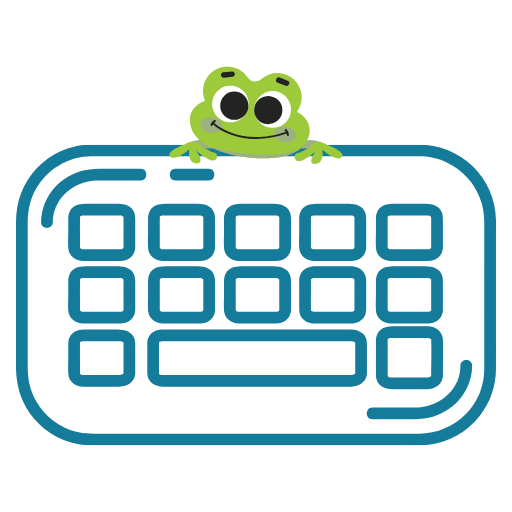
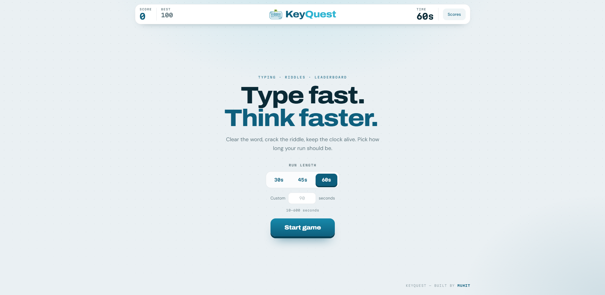
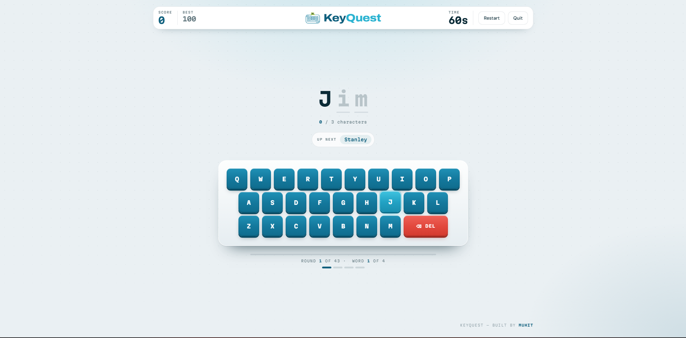
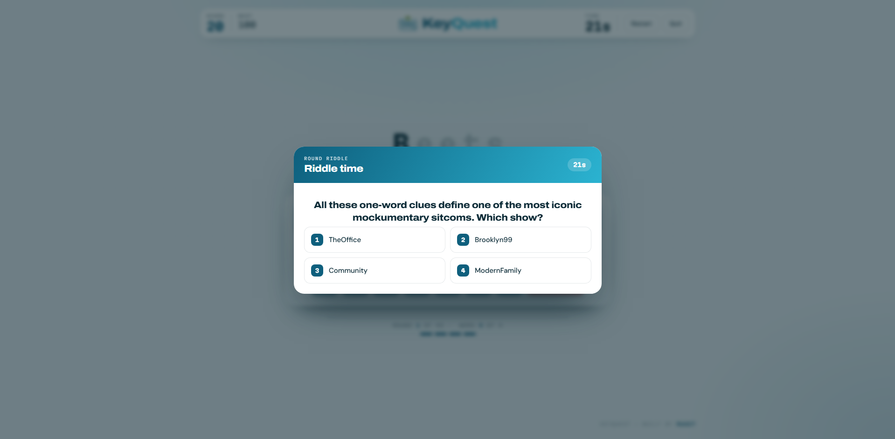
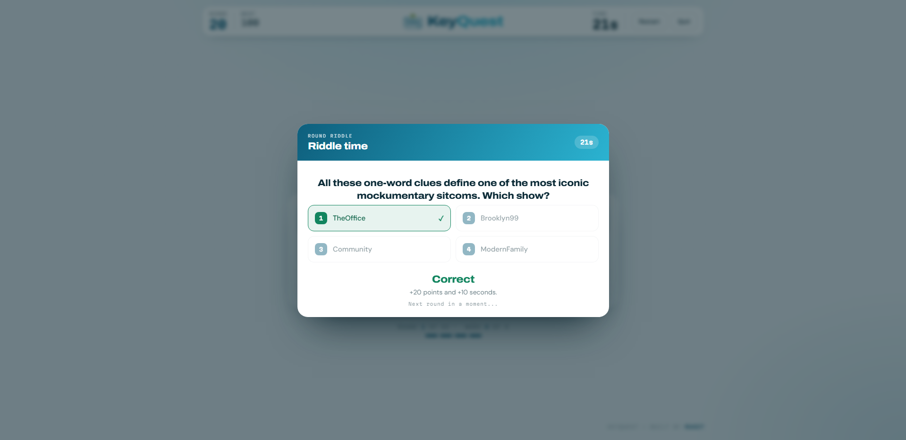
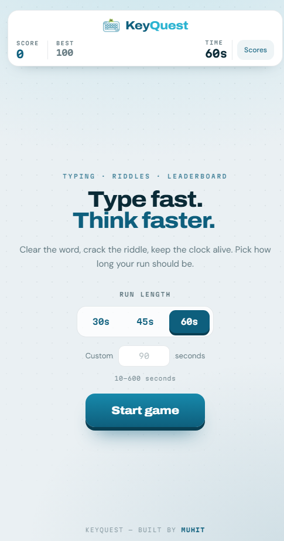

<p align="center">
  
</p>

<h1 align="center">KeyQuest</h1>

<p align="center">
  <strong>Type fast. Think faster.</strong><br />
  A typing and riddle game — clear the word, crack the riddle, keep the clock alive.
</p>

<p align="center">
  React 18 · Zero backend · Runs entirely in the browser
</p>

---

## Contents

- [What it is](#what-it-is)
- [Screenshots](#screenshots)
- [Features](#features)
- [How to play](#how-to-play)
- [Game rules](#game-rules)
- [Getting started](#getting-started)
- [Project structure](#project-structure)
- [Design system](#design-system)
- [Configuration](#configuration)
- [Adding riddles](#adding-riddles)
- [Data and storage](#data-and-storage)
- [Deployment](#deployment)
- [Security](#security)
- [Scripts](#scripts)
- [Known limitations](#known-limitations)
- [License](#license)

---

## What it is

KeyQuest is a browser typing game with a twist: the words you type are clues. Clear a round of four words and a riddle appears — the words were all hints toward one answer. Get it right and you earn points plus extra seconds. Get it wrong and the run ends.

**There is no backend.** No database, no accounts, no API keys, no environment variables. Clone it, `npm install`, `npm start`, and you are playing. Scores are kept in your browser's `localStorage`.

---

## Screenshots

> Screenshots live in [`docs/screenshots/`](docs/screenshots). Drop the files in with the names below and they will render here automatically.

### Start screen

The hero types itself out, then you pick a run length — 30/45/60 seconds or any custom value.



### Typing

The word is shown as underlined slots. Typed letters turn teal, the active slot pulses, and the next key you need lifts and glows on the deck below.



### Riddle

Clear all four words in a round and the riddle behind them opens. Answer with a click or by pressing `1`–`4`.



### Answer feedback

The correct option turns green, a wrong pick turns red, and the run continues after a beat.



### Mobile

The rail stacks, the deck scales down, and the whole board still fits at 375px.



---

## Features

| | |
|---|---|
| **Physical + on-screen input** | Type on your real keyboard or tap the keycap deck. Both are always live. |
| **Next-key hinting** | The key you need next lifts and glows, so the deck teaches as you play. |
| **Honest feedback** | The target word is always shown spelled correctly. A wrong key flashes the slot red — it never corrupts what is on screen and never skips ahead. |
| **Case-insensitive** | `LosPollos` types fine without hunting for Shift, so the on-screen deck is fully playable. |
| **Custom run length** | 30s, 45s, 60s presets, or anything from 10 to 600 seconds. |
| **Restart and quit mid-run** | Both live in the top rail — no page reload needed. |
| **43 riddle sets** | Each round pulls four random words from a riddle's word pool, so rounds vary between runs. |
| **Local leaderboard** | Top ten scores in `localStorage`, with a personal-best badge. |
| **Audio feedback** | Web Audio tones for hits, misses, and round results. No audio files to load. |
| **Reduced-motion aware** | Every animation collapses under `prefers-reduced-motion`. |

---

## How to play

1. **Pick a duration.** Tap 30s, 45s, or 60s — or type any value between 10 and 600 into the custom field.
2. **Hit Start game.** The clock begins immediately.
3. **Type the word.** Use your keyboard or click the keycaps. Capitalization does not matter. `Backspace` (or the red `DEL` key) removes the last correct letter.
4. **Watch the hint.** The glowing keycap is always the next letter you need.
5. **Clear four words** and the round's riddle opens.
6. **Answer the riddle** by clicking an option or pressing `1`–`4`. Correct means points and bonus time; wrong ends the run.
7. **Save your score** when the run ends to put it on the local leaderboard.

### Controls

| Input | Action |
|---|---|
| `A`–`Z` | Type a letter (case-insensitive) |
| `Backspace` | Delete the last correct letter |
| `1`–`4` | Pick a riddle answer |
| `Esc` | Close the leaderboard |
| Mouse / touch | Everything above, via the on-screen deck |

---

## Game rules

### Scoring

| Event | Points |
|---|---|
| Word completed | **+5** |
| Riddle answered correctly | **+20** |
| Wrong key pressed | **−3** (score never drops below 0) |
| Wrong riddle answer | Run ends |

### The clock

- Starts at your chosen duration and counts down only while you are typing — it pauses during the riddle.
- A correct riddle answer adds **+10 seconds**.
- Bonus time is capped at whichever is larger: your chosen duration, or 60 seconds.
- The clock turns red and pulses under 10 seconds.

### Rounds

- Each round is **4 words**, drawn at random from the current riddle's word pool.
- A word only completes when every letter matches. There is no auto-skip — a hard word costs you time, not progress.
- Clearing the riddle starts a new round with a fresh riddle you have not seen this run.
- The run ends on time-out, a wrong riddle answer, or after all 43 riddles.

---

## Getting started

### Prerequisites

- Node.js 16 or newer
- npm

### Install and run

```bash
npm install
```

```bash
npm start
```

The game opens at `http://localhost:3000`. Nothing to configure — no `.env`, no keys, no services.

### Build for production

```bash
npm run build
```

The `build/` folder is a fully static site. Roughly **56 kB gzipped** of JavaScript and **5 kB** of CSS.

---

## Project structure

```
KeyQuest/
├── public/
│   ├── index.html            Font links, favicon, meta
│   ├── logo.png              App logo / favicon / PWA icon
│   ├── manifest.json         PWA manifest
│   └── _headers              Security headers (Netlify format)
├── docs/
│   └── screenshots/          README screenshots
├── src/
│   ├── App.jsx               Game state machine, rail, stages
│   ├── index.css             The entire design system
│   ├── assets/
│   │   └── keyquest-logo.png Logo used in the top rail
│   ├── components/
│   │   ├── Keyboard.jsx      Keycap deck, physical + on-screen input, hinting
│   │   ├── WordDisplay.jsx   Word slots, character count, up-next pill
│   │   ├── RiddleModal.jsx   Riddle question, options, answer feedback
│   │   ├── ScoreBoardModal.jsx  Local leaderboard
│   │   ├── SaveScoreModal.jsx   Name entry after a run
│   │   └── OverScreen.jsx    Run-complete card
│   ├── constants/
│   │   └── texts.js          All copy + GAME_CONFIG
│   ├── data/
│   │   └── riddles.json      43 riddle sets
│   └── utils/
│       ├── leaderboard.js    localStorage leaderboard
│       └── security.js       Input validation and sanitization
└── package.json
```

---

## Design system

Everything is plain CSS with custom properties — no Tailwind, no CSS-in-JS, no UI library. The whole system lives in [`src/index.css`](src/index.css).

### Colour tokens

| Token | Value | Used for |
|---|---|---|
| `--ink` | `#0a2a36` | Primary text |
| `--deep` | `#0e5f7d` | Primary teal, headings, active states |
| `--teal` | `#1789ab` | Keycap faces |
| `--cyan` | `#2bb3d1` | Accents, glow, focus rings, progress |
| `--paper` | `#eaf0f3` | Page base |
| `--card` | `#ffffff` | Rail, modals, end card |
| `--alert` | `#e2483d` | Mistakes, DEL key, low clock |
| `--good` | `#12855f` | Correct answers, personal best |
| `--shade` | `rgba(10,42,54,.63)` | Secondary text |
| `--hair` | `rgba(10,42,54,.10)` | Hairline borders |

### Type

| Family | Role |
|---|---|
| **Archivo** (600/800) | Display — wordmark, hero, headings, primary buttons |
| **DM Sans** (400/500/700) | Body copy and UI labels |
| **Martian Mono** (400/600/700) | Numbers, keycaps, word slots, all-caps labels |

### Layout notes

- One page-level background: two fixed radial gradients over `--paper`, plus a masked dot grid on `body::before`. Every surface above it is transparent or an explicit card, so there are no seams.
- Keycaps use a hard bottom shadow (`0 4px 0`) that collapses on press, which is what makes the deck feel physical.
- The `--cap` and `--gap` tokens are `clamp()`-based, so the deck scales continuously from 375px to desktop without breakpoints.

---

## Configuration

All tunables live in `GAME_CONFIG` in [`src/constants/texts.js`](src/constants/texts.js):

| Key | Default | Meaning |
|---|---|---|
| `INITIAL_TIME` | `30` | Default run length in seconds |
| `TIME_PRESETS` | `[30, 45, 60]` | Preset buttons on the start screen |
| `MIN_CUSTOM_TIME` / `MAX_CUSTOM_TIME` | `10` / `600` | Bounds for the custom duration field |
| `BONUS_TIME` | `10` | Seconds granted per correct riddle |
| `MAX_TIME` | `60` | Lower bound of the bonus-time cap |
| `WORDS_PER_ROUND` | `4` | Words to clear before the riddle |
| `POINTS_PER_WORD` | `5` | Points per completed word |
| `POINTS_PER_RIDDLE` | `20` | Points per correct riddle |
| `POINTS_PENALTY_WRONG_KEY` | `3` | Points lost per wrong key |
| `MAX_PLAYER_NAME_LENGTH` | `20` | Leaderboard name limit |
| `LEADERBOARD_LIMIT` | `10` | Rows shown in the leaderboard |

All user-facing copy sits in the `TEXTS` object in the same file.

---

## Adding riddles

Append to `src/data/riddles.json`:

```json
{
  "id": 44,
  "words": ["Word1", "Word2", "Word3", "Word4", "Word5", "Word6"],
  "question": "What connects all of these?",
  "options": ["Option A", "Option B", "Option C", "Option D"],
  "correctAnswer": 1,
  "theme": "Theme Name"
}
```

- `words` must be **letters only** — no spaces, digits, or punctuation. A word with a space cannot be typed.
- List more words than `WORDS_PER_ROUND`; the game picks four at random each time the riddle comes up, so the round differs between runs.
- `correctAnswer` is a **zero-based index** into `options`.
- `id` should be unique. `theme` is metadata only.

---

## Data and storage

Three `localStorage` keys, all written by [`src/utils/leaderboard.js`](src/utils/leaderboard.js):

| Key | Contents |
|---|---|
| `keyquest_leaderboard` | Array of `{ id, name, score, time }`, capped at 100 entries |
| `keyquest_best_score` | Personal best across all runs |
| `keyquest_player_name` | Last name used, pre-filled on the next save |

Reads are validated and bounded, and every storage call degrades gracefully if `localStorage` is unavailable (private mode, quota). Clearing site data resets everything.

---

## Deployment

The build output is a static site — any static host works.

**Netlify:** build command `npm run build`, publish directory `build`. `public/_headers` is picked up automatically.

**Vercel / GitHub Pages / any static host:** deploy `build/`, and port the headers from `public/_headers` into your host's configuration.

---

## Security

KeyQuest sends nothing anywhere and stores nothing off-device, which removes most of the usual attack surface. What remains:

- **Input validation** — player names are checked against an allow-list pattern with a length cap
- **XSS protection** — script/iframe/handler patterns are rejected; `sanitizeText` escapes anything rendered as markup
- **Bounded storage reads** — leaderboard entries are type-checked before use
- **Security headers** — CSP (`default-src 'self'`, no `unsafe-eval`), `X-Frame-Options: DENY`, `nosniff`, `Referrer-Policy`, and a restrictive `Permissions-Policy` in `public/_headers`

See [SECURITY.md](./SECURITY.md) for detail and [SECURITY_CHECKLIST.md](./SECURITY_CHECKLIST.md) before deploying.

The leaderboard is deliberately **not** authoritative — it lives in the player's own browser, so it is a personal record rather than a competitive ranking.

---

## Scripts

| Command | What it does |
|---|---|
| `npm start` | Dev server at `localhost:3000` |
| `npm run build` | Production build into `build/` |
| `npm test` | Test runner |
| `npm run lint` | ESLint over `src/` |
| `npm run security:audit` | `npm audit` at moderate level |
| `npm run security:check` | Lint + audit together |

---

## Known limitations

- **Dependency advisories.** `npm audit` reports issues from `react-scripts`' build-time tree (webpack-dev-server, jest tooling). None of it is bundled into the browser build. The real fix is migrating off Create React App to Vite.
- **No tests yet.** `@testing-library` is installed but no specs are written.
- **Leaderboard is per-device.** Clearing site data or switching browsers loses it.

---

## License

MIT — see [LICENSE](LICENSE) if present, otherwise treat as MIT.

---

<p align="center">
  <sub>KeyQuest — built by <strong>Muhit</strong></sub>
</p>
